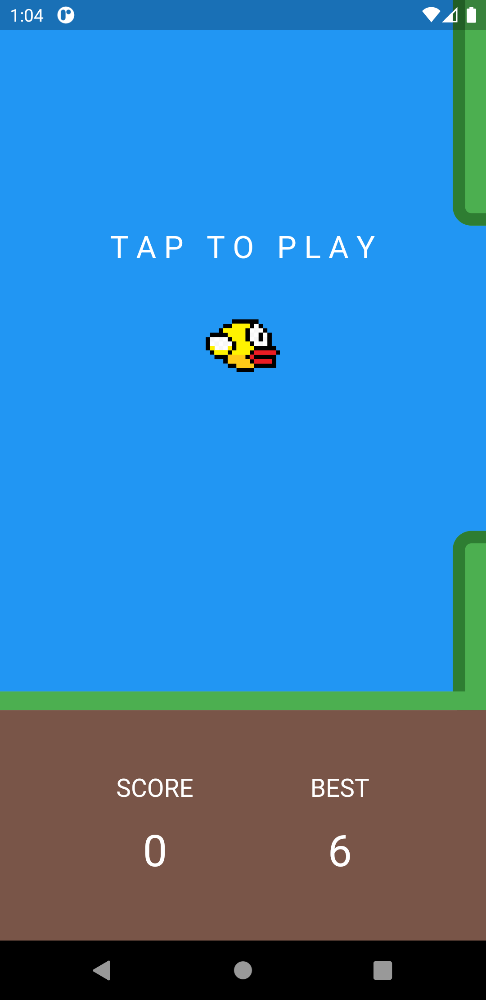
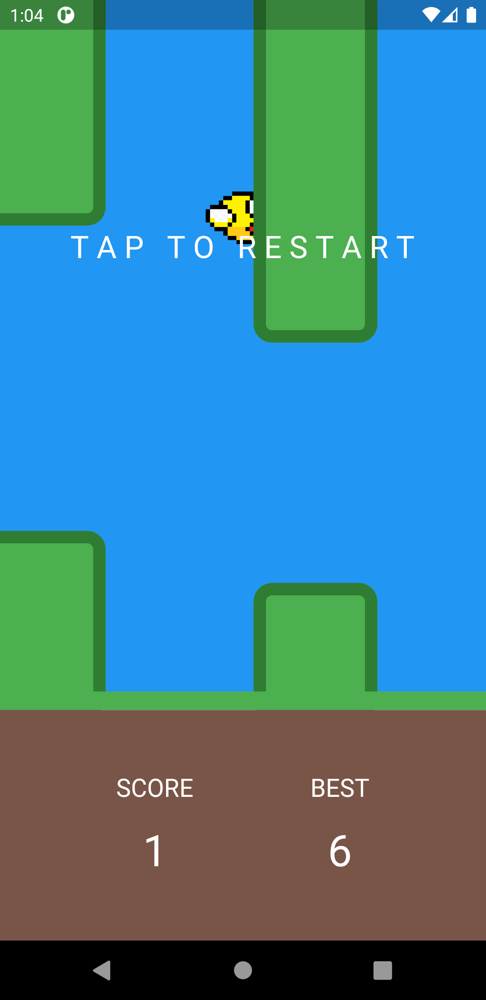

# Flappy Bird

Simple flappy bird app written in flutter+dart

## Screenshots
 
 

>## ToDo List:
>- Colision detection improvement
>- More fair generating of new pipes
>- Saving best score

## Sources
- [Video tutorial](https://www.youtube.com/watch?v=vgmVPpFP0fI)
  - Bird generation
  - Jump mechanic
